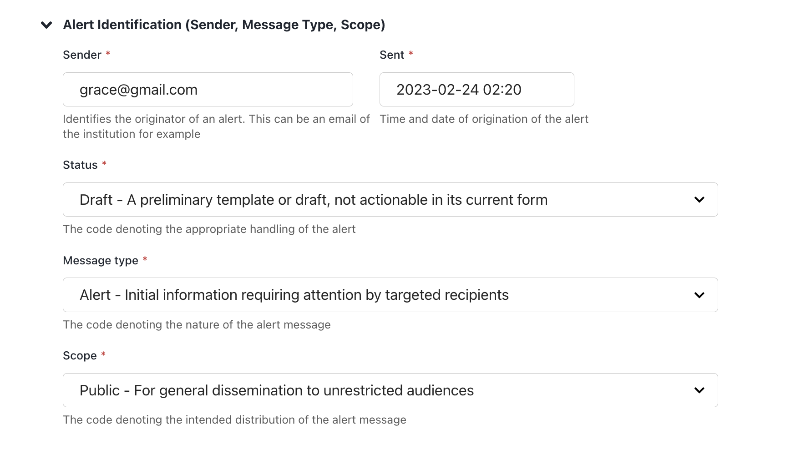

# CAP Composer  

[](https://github.com/wmo-raf/cap-composer/actions/workflows/publish.yml)

A [Wagtail](https://wagtail.io/) based Common Alerting Protocol (CAP) Warning Composer. This is a web-based tool for
creating and managing CAP alerts. It is designed to be used by meteorological and hydrological services, disaster
management agencies, and other organizations that need to create and disseminate CAP alerts.

The **Common Alerting Protocol (CAP)** provides an open, non-proprietary digital message format for all types of alerts
and notifications. It does not address any particular application or telecommunications method. The CAP format is
compatible with emerging techniques, such as Web services, as well as existing formats including the Specific Area
Message Encoding (SAME) used for the United States' National Oceanic and Atmospheric Administration (NOAA) Weather Radio
and the Emergency Alert System (EAS)

The CAP xml response follows the structure of the schema provided at
http://docs.oasis-open.org/emergency/cap/v1.2/CAP-v1.2-os.html

## Contents

- [CAP Composer](#cap-composer)
    - [Features](#-features)
    - [Quick start](#quick-start)
    - [Usage](#usage)
        - [Creating a CAP Alert](#creating-a-cap-alert)
        - [Sections in the Alert Page and corresponding XML](#sections-in-the-alert-page-and-corresponding-xml)
            - [A. Alert Identification](#a.-alert-identification)
            - [B. Alert Info](#b.-alert-info)
            - [C. Alert Area](#c.-alert-area)
            - [D. Alert Resource](#d.-alert-resource)
    - [Integrations](#integrations)

## 🌟 Features

- Modern user-friendly composer that follows [CAP 1.2](http://docs.oasis-open.org/emergency/cap/v1.2/CAP-v1.2-os.html)
  standard. Built on top of the awesome [Wagtail CMS](https://wagtail.org)
- Preview a CAP alert as you edit. Save drafts for sharing with colleagues and collaborating
- Inbuilt CAP validation. The page will not save if you have not input the required data according to CAP standard
- User-friendly alert area map tool that allows multiple ways of constructing alert geographic areas, while keeping the
  interface simple
    - Select country official administrative boundaries for different levels (Admin 1, Admin 2, Admin 3), with in-built
      simplification of complex boundaries
    - Draw a polygon
    - Draw a circle
    - Use Geocode key values
- Inbuilt publishing workflow using Wagtail's powerful page model, with automated emails to composers and approvers
- Collaborate with team members using inbuilt comments (similar to how you could do in Word) with automated
  notifications. Request for changes and approvals
- Publish realtime notifications/messages to third party integrations using MQTT messaging protocol
- Predefine a list of hazards types monitored by your institution, with intuitive icons
  from [OCHA humanitarian icons](https://brand.unocha.org/d/xEPytAUjC3sH/icons#/humanitarian-icons)
- Extendable to add your custom logic and functionality. The package provides an `abstract` django model that can be
  inherited for customizations. It is all python code.

## Quick start

#### 1. Install in virtualenvironment using pip

``` sh
pip install capeditor
```

#### 2. Configure settings

In your `settings.py` or `settings/base.py`, within the installed apps, include the `rest_framework, rest_framework_xml`
and `capeditor` as below:

``` py
INSTALLED_APPS = [
    # ...
    'rest_framework',
    'rest_framework_xml',
    'capeditor'
]
```

Set up restframeworkxml renderers

``` py
REST_FRAMEWORK = {
    'DEFAULT_RENDERER_CLASSES': (
        'rest_framework.renderers.JSONRenderer',
        'rest_framework_xml.renderers.XMLRenderer',  # add XMLRenderer
    ),
    'DEFAULT_PARSER_CLASSES': (
        'rest_framework_xml.parsers.XMLParser',
    ),
}
```

#### 3. Run model migrations

``` sh
python manage.py migrate
```

## Usage

### Creating a CAP Alert

With CAP composer successfully installed, both the Alert Listing page and Alert Detail page will be available on wagtail
admin interface.

    - AlertList
       |_ Alert 1
       |_ Alert 2

Create an `Alert Listing Page` by adding it as a child page and specifying the title of the page. This page will host a
list of all alerts created.


Create one or more `Alert Page` by adding it as a child to the
`Alert Listing Page`


------------------------------------------------------------------------

### Sections in the Alert Page and corresponding XML

The overall Document Object Model of an alert is as below:


#### Alert Identification

It contains the following entities required for a valid CAP message:

- Sender ID(sender),
- Sent Dat/Time (sent),
- Message Status (status),
- Message Type (msgType),
- Scope(scope),
- Restriction (restriction),
- Addresses (addresses),
- Note (note),
- Reference IDs (references) and
- Incident ids (incidents).

The alert identifier is generated automatically and is not editable.

***NOTE:*** Some fields are visible based on selection of different parameters.



#### Alert Info

Corresponds to the `<info>` element in the CAP message. The <info> entity specifies the alert's details. At least
one <info> block is required for an alert. If you support multiple languages, it is recommended that you use one <info>
block for each language for the same <alert> entity.:

A CAP message expects at least one `<info>` element to be present. Multiple `<info>` blocks should all have the
same `<category>` and `<event>` element values.


Each `Information` block contains the following elements:

- Language (Language)
- Event Category/Categories (category)
- Event Type (event)
- Response Type/Types (responseType)
- Urgency (urgency)
- Severity (severity)
- Certainty (certainty)
- Audience (audience)
- Event Code/Codes (eventCode)
- Effective Date/Time (effective)
- Onset Date/Time (onset)
- Expiration Date/Time (expires)
- Sender Name (senderName)
- Headline(headline)
- Event description (description)
- Instructions (instruction)
- Information URL (web),
- Contact Info (contact) and
- Parameter/Parameters(parameter)

#### C. Alert Area

Information Entity that defines the geographic area to be notified. Multiple areas can be defined in the alert. Each
area contains the following elements:

- Area Description (areaDesc),
- Area Polygon/Polygons (polygon),
- Area Circle/Circles (circle),
- Area Geocode/Geocodes (geocode),
- Altitude (altitude),
- Ceiling (ceiling)

The Alert area input has 4 selector options:

- Admin Boundary (area is picked from predefined boundaries). To use this option, ensure that admin boundaries are
  initially loaded. Refer to [Setting up boundaries](#setting-up-boundaries) section.


- Polygon (drawing a polygon)


- Circle (drawing a circle which specifies the latitude, longitude and radius)


- Geocode (specifying area geocode name and value). Using this option presumes knowledge of the coding system


#### Alert Resource

Entity that defines supplemental information related to an <info> object Multiple instances of this section are allowed.
It contains:

- Description (resourceDesc), MIME Type (mimeType), File Size (size), URI (uri), Dereferenced URI (derefUri) and
  Digest (digest)**

The Alert resource input has 2 selector options:

- File resource (takes in a file and description)


- External resource


## Integrations

To integrate the alerts to another wagtail page and include in templates, for example in the home page refer to sandbox
folder for sample standalone.

### MQTT Integration

You can publish a mqtt message immediately after a CAP alert has been published. This allows connected clients to
receive the CAP message using the MQTT protocol.

You will need to setup a MQTT broker. We have included the docker configuration to setup a local broker instance
using [Eclipse Mosquitto](https://mosquitto.org/)

You need to add a `CAP_BROKER_URI` setting to your `settings.py` which should be the URI to a MQTT broker with
permissions to publish messages.

Then using [Wagtail page_published signal](https://docs.wagtail.org/en/stable/reference/signals.html#page-published)
or [Wagtail after_publish_page hook](https://docs.wagtail.org/en/stable/reference/hooks.html#after-publish-page), you
can attach a function to publish the MQTT message.

Below is a sample snippet to achieve this in your `models.py`

```python
# models.py
from wagtail.signals import page_published

from capeditor.models import AbstractCapAlertPage
from capeditor.pubsub.publish import publish_cap_mqtt_message


class CapAlertPage(AbstractCapAlertPage):
    ....


def on_publish_cap_alert(sender, **kwargs):
    instance = kwargs['instance']

    topic = "cap/alerts/all"

    publish_cap_mqtt_message(instance, topic)


page_published.connect(on_publish_cap_alert, sender=CapAlertPage)
```

Using the sample above, once a CAP Alert Page has published, a corresponding `mqtt message` will also be published
immediately.

You will need to decide how to structure your MQTT alert topics.

You can have a complete look at the code under `sandbox/home/models.py`


