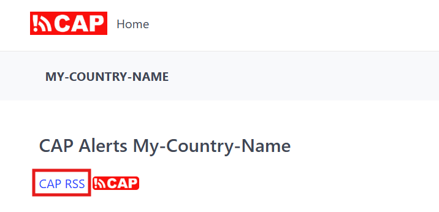

CAP RSS feed
============

The CAP Composer provides an RSS feed for the published alert messages compliant with the OASIS CAP version 1.2.
This allows users or downstream systems to subscribe to the feed and receive updates whenever a new alert is published.

The RSS feed will be available at:

.. code-block:: text

    https://<your_domain_name>/api/cap/rss.xml

The RSS feed is generated in real-time and includes all the published CAP alerts, with the most recent alerts appearing at the top of the feed.

The feed is intended for consumption by external applications, aggregators, or dissemination platforms that support RSS and/or CAP-based workflows.

Interpretation, distribution, and presentation of alert messages are the responsibility of the consuming system.

You can find the link of the RSS feed on the homepage of the CAP Composer as shown in the image below:

