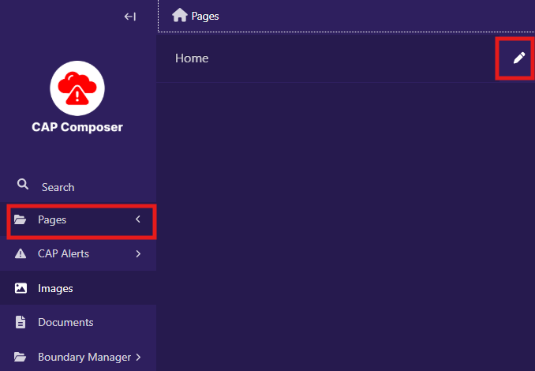
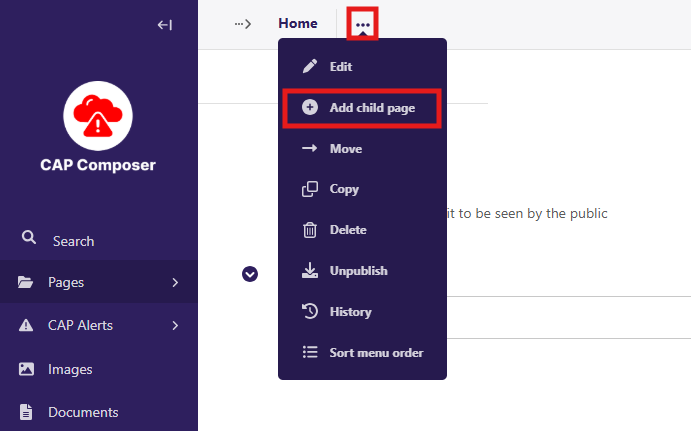
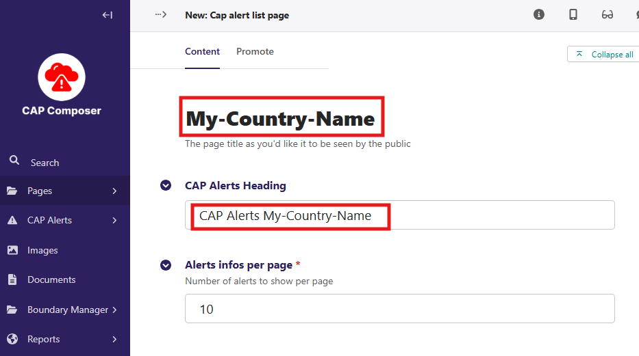
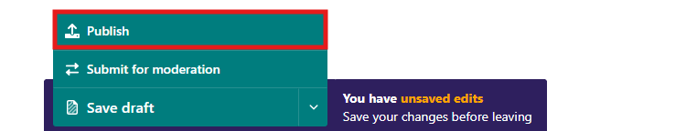
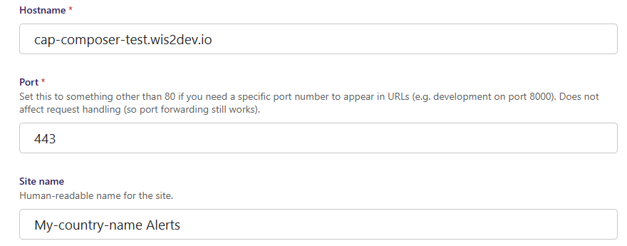
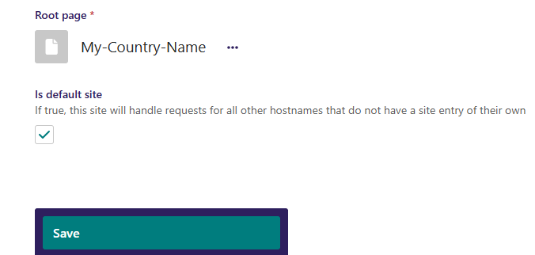
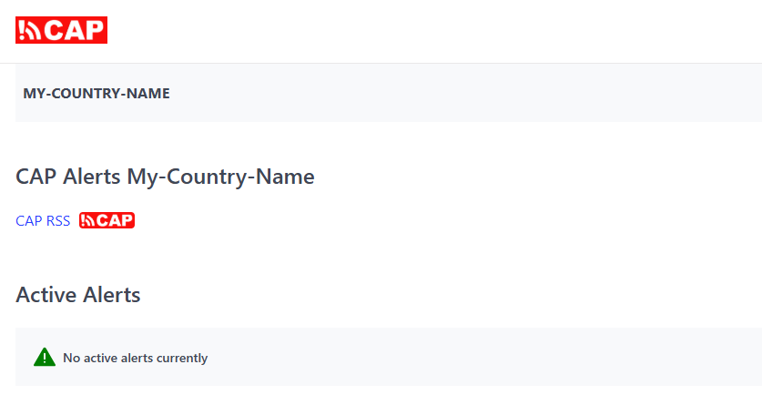

Creating the Alert Page
=======================

To use the CAP Composer, you need to create at least one CAP Alert page. This is the page within Wagtail that will display the CAP Alerts to the public.

To create a CAP Alert page, follow these steps:

Login to the Wagtail admin interface and click on the "Pages" section in the sidebar.

Click on the "Edit" button next to the "Home" page to open the page editor:

In the page editor, click on the 3 dots and click "Add Child Page" button to create a new page under the Home page.

Provide a page title and a CAP Alerts Heading for your CAP Alert page:

Open the menu at the bottom of the page and select "Publish" to publish the page:

**Next we need to configure the "sites" settings to make sure that the CAP Alert page we just created is set as the default page for our website.**

Go to the "Settings" section in the sidebar and click on "Sites":

.. image:: ../_static/images/cap_composer_sites.png
      :alt: WMO CAP Composer Sites

Then click on the "Edit" button next to the default site to open the site settings and configure as in the example below, replacing the "Host name" field with your own domain name:

Then replace the default Home page with the CAP Alert page you just created by selecting the sub-page,
make sure to enable the "Is default site" option and then click on "Save":

Go to your URL at `https://<your_domain_name>` and you will see the entry for the CAP Alert page you just created:

**Next**: Proceed to the :doc:`user management <user-management>` section to create the groups and users required for composing and approving alerts.

