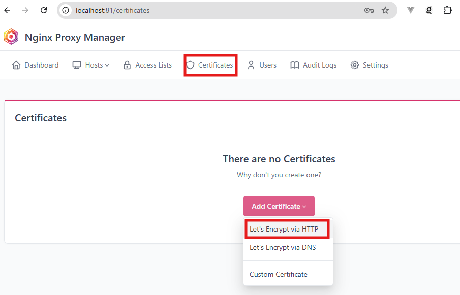
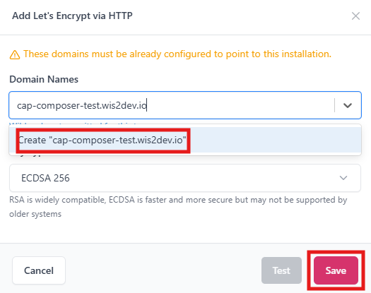
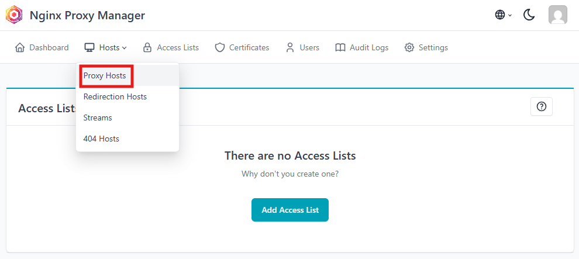
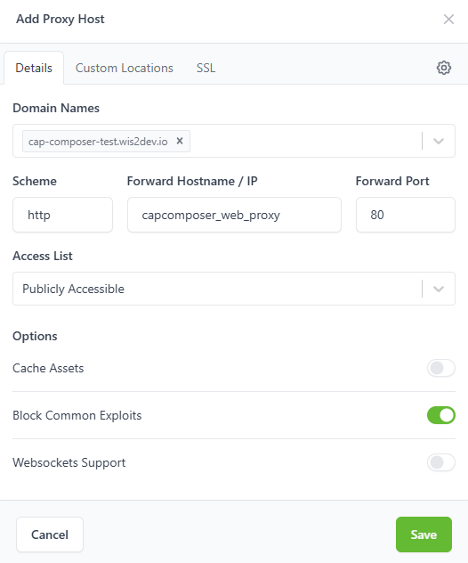
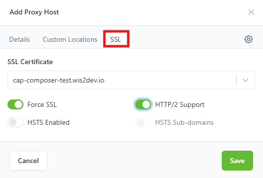

Securing your installation
==========================

To use the WMO CAP Composer in a production environment and send out CAP alerts, you need to secure your installation by setting up SSL on your website.
This section will guide you through the process of securing your installation.

You will need to make sure you have configured a Domain Name System (DNS) record for your website and that the domain name points to the IP address of your server. 
Ports 80 and 443 should be open to the public, port 80 will be used for renewal of SSL certificates and port 443 will be used to serve the CAP Composer website over HTTPS. 

Setting up SSL
--------------

The standalone docker-compose stack included in this repository includes the `Nginx Proxy Manager <https://nginxproxymanager.com/>`_ to help you setup SSL on your website.

By default this container will be listening on port 81, you can access the Nginx Proxy Manager by visiting `http://localhost:81` if you are accessing it from the server itself.

The first time you access the Nginx Proxy Manager you will be prompted to provide name, email and password to create an account.

Once you are logged in, you will see the Nginx Proxy Manager dashboard, click on `Certificates` tab and then click on `Add Certificate` and select `Let's Encrypt via HTTP`:

Type in your domain name in the input box, click on `Create <your_domain_name>` and than click on the `Save` button to create the certificate:

After saving the certificate, you will then go to the `Dashboard` select the `Hosts` tab and click on the `Add Host` button:

There you will fill the form with your own domain name, make sure to define **capcomposer_web_proxy** and port **80** as the forward host and port as shown in the image below:

After filling this form go to the SSL section where you will fill the form in order to add the certificate you created before.

After saving the proxy host, you will see the new host in the list. You can now access your CAP Composer using your domain name and with SSL enabled.

Finally go to the `Settings` tab and set the *Default Site* to Redirect to `https://<your_domain_name>` and save the changes.

**Next**: Proceed to the :doc:`Creating the Alert Page <creating-alert-page>` section to create the CAP Alert page that will be displayed at `https://<your_domain_name>`.