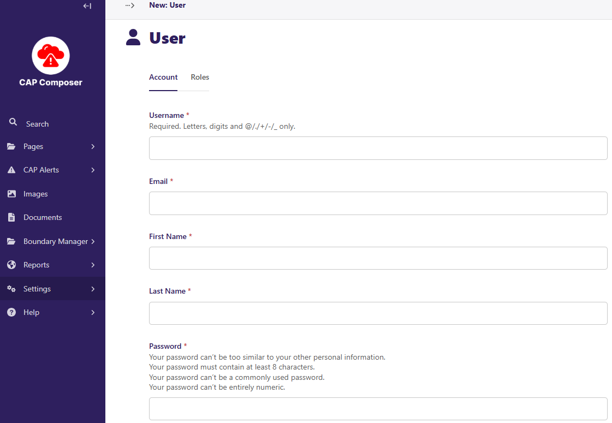

Creating Groups and Users
=========================

When using the CAP Composer for alert creation and dissemination, it is essential to establish roles and permissions for users to ensure that alerts are accurate, authorized, and disseminated effectively.

At a minimum, two key roles are required for the alert creation and approval process:

- **CAP Composer Role:** A CAP Composer is responsible for creating and drafting alert messages. This role involves collecting pertinent information about an incident and structuring it according to the CAP format. The Composer ensures that all necessary details are included to inform the public or specific agencies effectively.
- **CAP Approver Role:** The CAP Approver reviews the alerts composed by the Composer. This role is crucial for validating the content, ensuring compliance with organizational protocols, and authorizing the release of the alert to the intended audience. The Approver acts as a quality control measure to prevent the dissemination of incorrect or unauthorized information.

You will need to create `Groups` for each role and assign users to these groups based on their responsibilities using the Wagtail Admin interface.

This section provides guidance on configuring Composer and Approver groups in the CAP Composer.	

Configuring Composer and Approver Groups
^^^^^^^^^^^^^^^^^^^^^^^^^^^^^^^^^^^^^^^^

The general process for setting up Composer and Approver groups involves the following steps:

1. *Access the User Management or Administration Section:*
   - Navigate to the system's settings where users and groups are managed. 

      .. image:: ../_static/images/cap_composer_user_settings.png
            :alt: WMO CAP Composer User Settings

2. *Define Roles and Permissions:*
- Click on groups
- Create roles/groups titled "Composer" and "Approver." and assign permissions to each role based on their responsibilities:

    - *Composer:* Permissions to create and edit alerts but not to publish them.

        .. image:: ../_static/images/cap_composer_composer_1.png
            :alt: WMO CAP Composer Composer Role

        .. image:: ../_static/images/cap_composer_composer_2.png
            :alt: WMO CAP Composer Composer Role

    - *Approver:* Permissions to review, approve, or reject alerts, and to publish approved alerts.

        .. image:: ../_static/images/cap_composer_approver_1.png            
            :alt: WMO CAP Composer Approver Role

        .. image:: ../_static/images/cap_composer_approver_2.png
            :alt: WMO CAP Composer Approver Role

      **It is recommended to enable 2Factor authentication for the Approver role to enhance security, as this role has the authority to publish alerts.**

      See the :doc:`2-Factor Authentication <2fa>` section on how to enable this feature in the CAP Composer.

3. *Assign Users to Roles:*
   - Allocate users to the Composer and Approver roles based on their job functions and expertise.

4. *Implement Approval Workflows:*
   - Configure the system's workflow to require approval from an Approver before an alert created by a Composer can be published.

5. *Test the Workflow:*
   - Conduct tests to ensure that alerts follow the correct path from composition to approval and finally to dissemination.

User management
---------------

Users are created and managed in the CAP Composer to facilitate collaboration and assign roles for composing, reviewing, and approving alerts.

User Creation
-------------

To create a new user in the CAP Composer after selecting Users in the Settings click on Add a User and enter the following page:

Group Assignment
----------------

Roles are assigned by using the groups defined in the steps detailed before, one of these groups that is defined by default is the Admin group.

The Admin is responsible for managing users in the CAP Composer. The Admin can create, edit, and delete users. The Admin can also assign roles to users to control their access to the CAP Composer.

.. image:: ../_static/images/cap_composer_user_admin.png
      :alt: WMO CAP Composer User Admin

**Next**: Proceed to the :doc:`CAP base settings <cap-base-settings>` section to set up the base configuration for the CAP Alerts specific to your country.